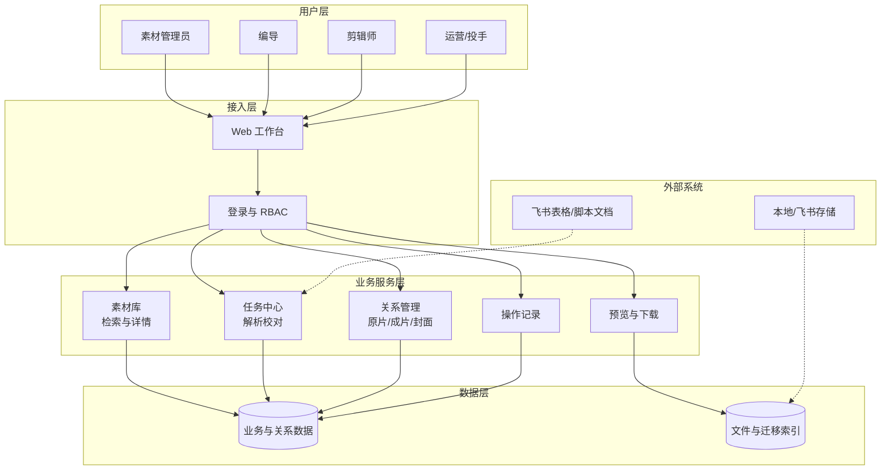
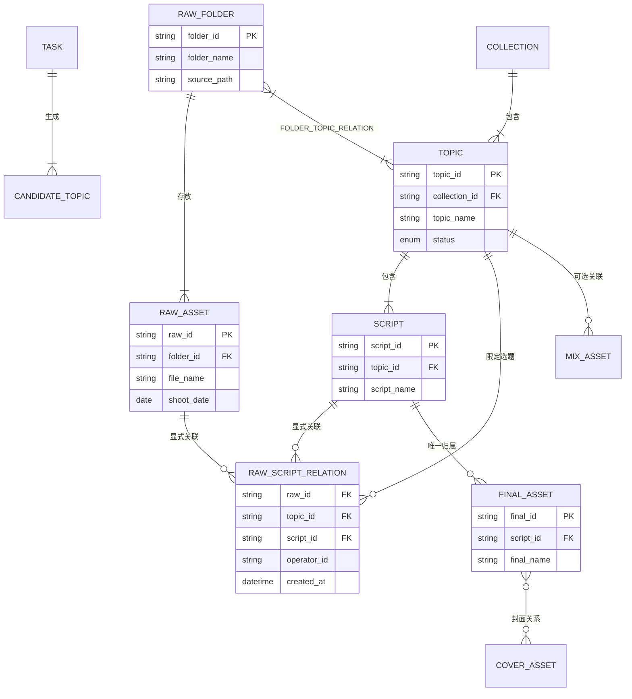
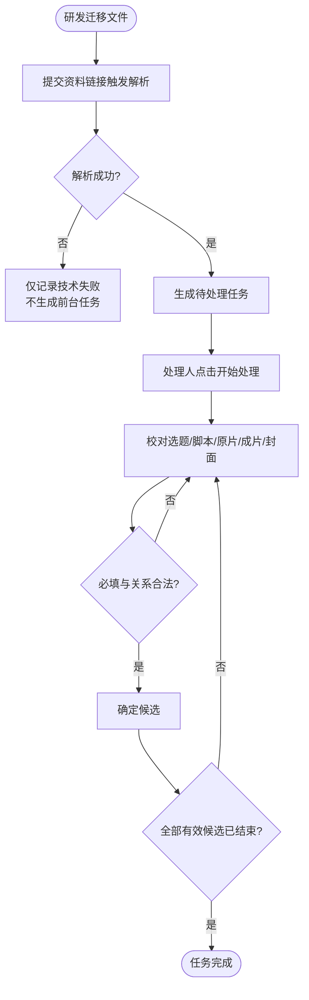
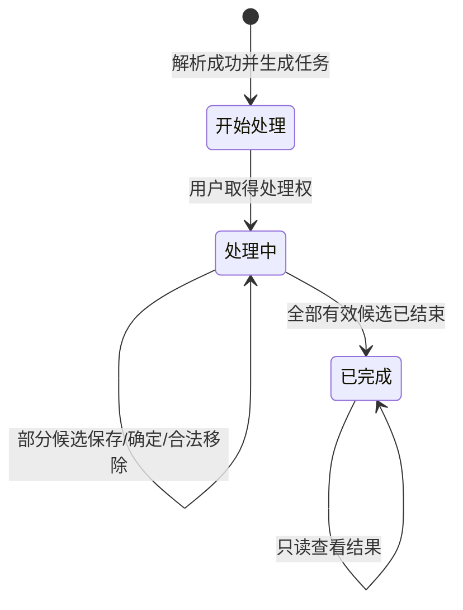

# 素材库 PRD V113.2（正式交付版）

| PRD 属性 | 内容 |
| --- | --- |
| 产品定型 | 企业内部自研 × 业务型内容资产管理系统 × Web 产品 |
| 文档用途 | 素材库一期研发实施、交互走查与测试验收的唯一业务规则基线 |
| 文档版本 | V113.2 |
| 文档状态 | 正式交付版 |
| 重要性／紧迫性 | 高／高 |
| 需求方 | 公司视频内容生产团队 |
| PRD 编写人 | 李斯仪 |
| PRD 审核人 | [TODO：填写] |
| PRD 提交日期 | 2026-10-09 |

## PRD 修改记录

| 变更时间 | 变更内容 | 理由 | 修改人 | 审核人 | 版本 |
| --- | --- | --- | --- | --- | --- |
| 2026-10-09 | 明确编导备注支持文本与链接混合内容，并补充链接识别、安全、展示与验收边界 | 满足编导在脚本备注中保存参考资料链接的需求，同时避免其他备注字段被错误扩展为链接字段 | 李斯仪 | [TODO] | V113.2 |
| 2026-10-09 | 统一首页五类对象的日期展示、筛选、最近排序及日期变化规则 | 消除合集创建／更新、视频迁移／业务日期混用，保证展示、查询和排序口径一致 | 李斯仪 | [TODO] | V113.2 |
| 2026-10-08 | 从历史工作稿重建唯一正式 PRD；校正原片文件夹—选题—脚本关系；同步当前原型口径 | 消除多版 PRD 冲突及“原片唯一脚本归属”错误模型 | 李斯仪 | [TODO] | V113.1 |

> **权威性声明**：本文档是当前唯一研发实施基线。V113.1、`PRD-V112-to-V113/`、`素材库PRD文档.md`、各种 `backup`、评审记录及差异清单均仅用于历史追溯；与本文档冲突时，一律以本文档为准。

---

## 1、项目背景

### 1.1 业务现状

选题、脚本和业务字段主要在飞书表格及脚本文档中维护，原片、成片和封面分布在本地及飞书存储中。研发需先完成文件迁移，再解析业务资料；素材管理员或编导在任务中校对并确定。一期不承接从空白创作选题、脚本、拍摄或剪辑的生产流程。

### 1.2 核心问题

1. **资产分散**：业务内容与视频文件分布在多个载体，缺少统一查询和追溯。
2. **关系易失真**：原片文件夹、选题、脚本、成片及封面的关系主要依赖文件名和人工记忆。
3. **历史规则冲突**：旧文档曾将原片误定义为唯一归属某一脚本，或反过来误定义为“选题下所有未来脚本自动继承”。真实流程是：文件夹先关联选题，再建立原片与具体脚本的显式关系。
4. **校对与正式资产边界不清**：候选关系、正式关系、文件事实和业务字段需要分层管理。

### 1.3 解决思路

- 建立统一的合集、选题、脚本、原片文件夹、原片、成片、封面和混剪资产模型。
- 通过“研发先迁移→系统解析资料→业务校对→确定入库”形成可追溯闭环。
- 将原片关系定义为“文件夹先关联选题、原片再显式关联具体脚本”；新增脚本不自动继承原片。
- 将普通成片继续定义为唯一选题／脚本归属，封面作为成片的可选横版／竖版关系。

### 1.4 决策依据

- 历史成片约 8,500 条，每日新增约 30–50 条（沿用项目现有资料，上线前由业务再确认）。
- 原片与选题名称不一定一致，不得通过名称相同自动建立正式关系。
- 业务确认原片文件夹首先关联选题，而不是唯一归属某一脚本。

---

## 2、需求基本情况

| 要素 | 内容 |
| --- | --- |
| 需求提出人 | 视频内容生产与素材管理团队 |
| 核心使用人 | 素材管理员、编导 |
| 其他使用人 | 剪辑师、运营、投手 |
| 受影响人 | 研发迁移与解析责任人、内容管理负责人 |
| 核心场景 | 历史素材迁移校对、日常新资料接入、正式资产检索、选题详情与素材关系维护 |
| 核心痛点 | 文件事实、业务对象和多层关系分散，无法稳定追溯和复用 |
| 需求价值 | 建立唯一资产入口和可追溯关系，降低人工查找、误关联和重复迁移成本 |

### 2.1 核心场景

**场景 A：迁移资料校对入库**

- 研发先按原目录迁移原片、成片及已提供封面，然后提交飞书资料链接触发解析。
- 系统生成任务与候选选题，处理人校对字段、文件夹、原片、成片及封面。
- 所有必填字段与文件关系合法后，候选确定并正式入库。

**场景 B：选题与原片关系维护**

- 素材管理员在选题编辑态搜索已迁移原片文件夹。
- 确认后先建立文件夹—选题关系，再将原片与当前已选脚本建立显式关系。以后新增脚本不自动继承，需要重新搜索关联原片。
- 某脚本不需要某原片时，只在该脚本移除，不影响其他关系。

**场景 C：素材检索与复用**

- 用户在首页通过全局关键词、对象 Tab 和结构化筛选查询合集、选题、原片、成片和混剪。
- 从列表进入选题或播放视频，返回时恢复来源 Tab、筛选、页码和有效滚动位置。

---

## 3、业务分析与系统调研

### 3.1 现有工具与参考

| 对象 | 类型 | 当前能力 | 可借鉴点 | 局限 |
| --- | --- | --- | --- | --- |
| 飞书表格／脚本文档 | 内部现有工具 | 维护选题、脚本及业务字段 | 模板灵活、业务已熟悉 | 不适合统一管理大量视频与复杂关系 |
| 本地／飞书文件存储 | 内部现有工具 | 存放原片、成片、封面 | 保留原目录和文件事实 | 不承载稳定业务关系 |
| 素材库系统 | 本期建设 | 统一解析、校对、检索、查看和关系管理 | 以稳定 ID 与操作记录建立可追溯资产 | 一期不承载内容生产流程 |

### 3.2 业务痛点优先级

| 优先级 | 痛点 | 影响 | 严重程度 |
| --- | --- | --- | --- |
| P0 | 原片关系模型与真实业务不一致 | 导致误删关系、无法复用和错误禁用原片 | 高 |
| P0 | 多份 PRD 与原型规则不一致 | 研发与测试无法确认真实口径 | 高 |
| P1 | 历史资料量大、依赖人工校对 | 处理成本高、误差不可追溯 | 中高 |
| P1 | 素材检索和跳转上下文容易丢失 | 日常查找和复用效率低 | 中 |

### 3.3 投入产出评估

| 维度 | 估算 |
| --- | --- |
| 预计投入 | [TODO：研发、测试、产品、迁移与业务校对人力] |
| 效率收益 | 缩短历史关系查找、日常素材检索和错误关系修复耗时 |
| 质量收益 | 原片、成片与选题关系可追溯，减少文件重复迁移和误覆盖 |

---

## 4、项目目标与验收总则

### 4.1 项目目标

| 目标类型 | 目标 | 指标 | 目标值 |
| --- | --- | --- | --- |
| 业务目标 | 建立统一可追溯素材关系 | 正式关系指向有效对象比例 | 100% |
| 质量目标 | 消除原片唯一脚本归属错误 | 原片多选题／多脚本关系验收通过率 | 100% |
| 效率目标 | 支持从资料解析到正式入库闭环 | 有效候选确定成功率 | [TODO：上线指标] |
| 体验目标 | 保证列表、详情和播放上下文稳定 | 高频任务关键路径可完成率 | 100% |

### 4.2 交付验收总则

1. 页面、接口、数据关系和操作记录必须使用同一业务口径。
2. 原片文件夹关联选题后，还需为原片选择具体脚本并建立显式关系；未选脚本及以后新增脚本不自动获得原片。
3. 脚本内移除原片只影响精确的“原片＋选题＋脚本”组合。
4. 同一原片可同时对多选题、多脚本有效，但首页只展示一张原片卡片。
5. 普通成片仍唯一归属一个选题下的一份脚本。
6. 所有写操作进行权限、对象有效性、并发版本和关系完整性校验。

---

## 5、项目方案概述

### 5.1 核心功能

| 模块 | 功能简述 | 优先级 |
| --- | --- | --- |
| 素材库首页 | 统一搜索并分 Tab 展示合集、选题、原片、成片和混剪 | P0 |
| 合集／选题详情 | 查看选题字段、脚本、原片和成片；按权限统一编辑 | P0 |
| 原片关系管理 | 文件夹关联选题、原片显式关联脚本、可调整或解除具体脚本关系 | P0 |
| 普通成片与封面 | 成片唯一脚本归属，可选关联横版、竖版封面 | P0 |
| 任务中心／解析结果 | 承接研发迁移后资料的校对、修改、确定与追溯 | P0 |
| 混剪资产 | 独立管理混剪，可选关联一个选题 | P1 |
| 下载与操作记录 | 按权限下载脚本包或单条视频，保留关键变更记录 | P1 |

### 5.2 MVP 范围

**包含**：迁移后资料解析校对、正式入库、首页检索、合集／选题详情、原片关系、成片和封面、混剪、单条下载、权限、操作记录。

**不包含**：业务用户上传新视频、从空白新建选题／脚本、拍摄、剪辑、审片、硬删除正式资产、视频批量下载。

---

## 6、项目范围

### 6.1 涉及系统

| 系统 | 关系 | 责任 |
| --- | --- | --- |
| 素材库 Web 系统 | 主体 | 列表、详情、任务、关系、权限和记录 |
| 飞书表格／脚本文档 | 数据来源 | 提供选题、脚本、原片文件夹线索与成片字段 |
| 视频／文件存储 | 文件来源 | 按原目录迁移并提供预览／下载 |
| 现有用户、角色与 IP 主数据 | 平台能力 | 提供登录、角色、编导／出镜 IP 字典 |

### 6.2 影响范围

- **用户**：素材管理员、编导的校对和维护方式；剪辑师、运营、投手的查询和下载方式。
- **流程**：新增研发后台迁移和解析前置，业务从任务中心进入校对。
- **数据**：历史合集、选题、脚本、原片、成片、封面和混剪迁移及关系校准。

### 6.3 不在本期范围

1. 前台上传、替换或硬删除视频文件。
2. 视频剪辑、审片、发布、投流和平台数据回收。
3. 合集、选题或正式脚本的前台硬删除。
4. 通过视频画面的 AI 内容理解、自动分类或自动关联。
5. 对编导备注中的外部链接进行内容抓取、文件下载、网页预览、标题解析或可用性承诺。
6. 将成片备注、剪辑备注及其他普通文本字段自动识别为可点击链接；本期链接能力仅适用于编导备注。

---

## 7、前提、约束与风险

### 7.1 前提与约束

| 编号 | 内容 | 影响 |
| --- | --- | --- |
| A1 | 研发在解析前已完成原片、成片及已有封面迁移 | 迁移未完成时前台只能提示联系研发，不提供临时上传 |
| A2 | 源文档模板在开发前形成版本化字段映射 | 模板变动需同步解析规则与测试样例 |
| C1 | 正式入库内容只有素材管理员可编辑 | 其他角色界面与接口均只读 |
| C2 | 一期不提供视频批量下载 | 选择控件不得误导为下载多选 |

### 7.2 风险

| 风险 | 概率 | 影响 | 应对 |
| --- | --- | --- | --- |
| 历史 PRD 仍被当作开发依据 | 高 | 高 | 仓库 README 和历史文档顶部明确标记本文档为唯一基线 |
| 原片关系仍按唯一 `scriptId` 实现 | 高 | 高 | 开发前评审 ER 模型：保留文件夹—选题关系，同时用多对多关系表管理原片—脚本关系 |
| 迁移文件名或路径不稳定 | 中 | 高 | 使用稳定 ID 管理身份，名称只用于展示和搜索 |
| 多人并发编辑覆盖 | 中 | 高 | 乐观锁＋版本冲突提示＋拒绝静默覆盖 |
| 大视频预览或下载失败 | 中 | 中 | 代理预览失败时保留业务信息与授权原文件下载 |

---

## 8、术语

| 术语 | 定义 |
| --- | --- |
| 合集 | 一条业务线下承载多个选题的业务容器 |
| 选题 | 承载选题信息、脚本、原片文件夹关系及成片的核心业务对象 |
| 原片文件夹 | 按原目录迁移的原片容器，也是原片关联选题的业务对象 |
| 脚本显式关联 | 原片在具体脚本中展示，必须存在“原片＋选题＋脚本”关系；新脚本不自动继承 |
| 脚本关系解除 | 解除某原片与当前脚本的关系，不影响选题、其他脚本、其他选题及原文件 |
| 普通成片 | 唯一归属一个选题下具体脚本的已剪辑视频 |
| 混剪 | 独立视频对象，可选关联零个或一个选题，不关联脚本 |

## 9、参考文档

| 文档 | 用途 |
| --- | --- |
| `素材库PRD文档.md` | V3.0 业务底稿，仅历史追溯 |
| `PRD-V112-to-V113/03_素材库PRD_V113_结构去重工作稿.md` | 历史修订与验收案例来源，不作为开发基线 |
| `素材库原型_V113修改工作版.html` | 当前交互原型，页面细节需与本 PRD 对齐 |

---

## 10、功能需求

### 10.1 产品框架

#### 10.1.1 应用架构



#### 10.1.2 核心数据模型



**关系计算规则**：

```text
某脚本有效原片
= 存在有效“原片×选题×脚本”显式关系的原片
且原片文件、脚本和选题均为有效状态
```

#### 10.1.3 核心业务流程



#### 10.1.4 任务状态机



### 10.2 功能详解

#### 10.2.1 素材库首页

**页面结构**

- 顶部只保留一个全局关键词搜索框。
- 对象 Tab 固定为：全部／选题／原片／成片／混剪。
- 筛选与重置固定在筛选区右侧，不因字段数量变动位置。
- 各 Tab 独立保存关键词、筛选、页码和滚动位置。
- 卡片长字段单行省略，鼠标悬停显示完整值。

**日期展示、筛选与排序的唯一口径**

| 对象 Tab | 列表展示日期 | 日期筛选字段 | “最近”排序字段 | 字段来源与变化时机 |
| --- | --- | --- | --- | --- |
| 全部／合集 | 创建日期 | 创建日期 | 创建日期倒序 | 合集首次成功创建时生成，之后不随选题或素材变更而改变 |
| 选题 | 更新日期 | 更新日期 | 更新日期倒序 | 选题或其脚本业务字段正式保存成功后更新；进入编辑、取消或保存失败不更新 |
| 原片 | 拍摄日期 | 拍摄日期 | 拍摄日期倒序 | 来源资料解析或有权用户校对的实际拍摄日期；迁移、关联、调整归属或修改备注不自动改变 |
| 成片 | 剪辑日期 | 剪辑日期 | 剪辑日期倒序 | 来源资料解析或有权用户校对的实际剪辑完成日期；迁移、关联封面、调整归属或修改备注不自动改变 |
| 混剪 | 剪辑日期 | 剪辑日期 | 剪辑日期倒序 | 来源资料解析或有权用户校对的实际剪辑完成日期；关联选题、调整归属或修改备注不自动改变 |

- 每个 Tab 只展示上表对应的一类业务日期，不在同一列表同时提供创建、更新、迁移、上传等多套日期筛选。
- 日期筛选使用“开始日期—结束日期”区间；起止边界均包含。只填开始日期时查询该日及之后，只填结束日期时查询该日及之前。
- 日期筛选为空时不限制结果；启用日期筛选后，对应业务日期为空的记录不命中。
- “最近”不得使用迁移时间、上传时间、关联时间或最后操作时间替代上表的业务日期。
- 预览、下载、搜索关联、移除关联、调整归属、关联封面及备注修改不自动改写拍摄日期或剪辑日期。

**合集卡片**

- 用途标签放在合集名称右侧。
- 底部只展示“创建”及合集创建日期，不展示合集更新日期。

**选题卡片**

- 用途标签放在选题名称右侧；编导放在产品线下方。
- 底部只展示“更新日期”，不同时展示创建日期。

**原片卡片**

- 视频区左上角仅在场景有值时显示场景标签，不显示组合设备／机位标签。
- 信息区显示原片名称、文件大小、摄像与拍摄日期；底部按“摄像姓名 · 日期”展示，不显示“摄像”字样。
- 没有脚本时按需显示“脚本 -”；首页原片卡片不展示具体选题／脚本路径或关系数摘要。
- 同一稳定原片 ID 只展示一张卡片。
- “查看选题”：只有一个有效选题时直接进入；多选题时先让用户选择；未关联时隐藏入口。

**成片卡片**

- 展示成片名称、平台、剪辑方向、视频类型、剪辑师、剪辑日期及可选封面。
- 成片关系唯一指向具体选题／脚本，“查看选题”直接进入并定位脚本。

**混剪卡片**

- 展示混剪标题、关联选题（无关联显示“-”）、编导、剪辑师和剪辑日期。
- 不展示合集字段。

#### 10.2.2 选题详情与统一编辑

- 顶部展示选题名称、编导、用途、平台、业务线、产品线、出镜 IP、出镜素人等已确认信息。
- 脚本使用 Tab 切换；切换脚本只改变当前脚本内容、有效原片集合和成片集合。
- 正式详情只有一个“编辑”入口；进入后允许的字段与关系共用一次保存。
- 编辑态有未保存内容时，切换脚本或离开页面必须提示放弃修改。
- 脚本拍摄字段包括：场景、视觉锤、服装、动作、摄像、设备、机位、道具、镜号、音频。同类多值使用独立输入框复用现有输入样式，不合并为一个长字符串。
- 历史脚本允许没有原片、没有成片，或只有其中一种；原片数和成片数均为 `0..N`，不作为确定入库或保存的阻断条件。
- `摄像` 为可空字段。历史资料未记录摄像时，详情保留该字段位置但值留空；不自动填充人名，不触发必填错误。

**编导备注与链接规则**

- 编导备注支持纯文本，以及纯文本与一个或多个链接混合输入；保存时必须完整保留用户输入的文字、链接内容及先后顺序，不自动改写备注。
- 系统仅将包含完整协议的 `http://` 或 `https://` 地址识别为链接。无法识别的地址或不完整地址按普通文本保存和展示，不阻止整条备注保存。
- 正式详情态中，识别成功的链接显示为可点击文本；点击后在新标签页打开，当前素材库页面、脚本位置及页面状态保持不变。
- 编辑态仍以原始文本显示和编辑，不将链接拆分为独立字段，不因链接数量改变编导备注的数据结构。
- 长链接必须自动换行或在不丢失原始值的前提下省略展示，不得撑破内容区、遮挡相邻字段或造成横向滚动。
- `javascript:`、`data:`、`file:` 等非 `http(s)` 协议不得生成可点击链接；前端展示和跳转必须进行安全转义，并使用安全的新标签页打开方式。
- 系统不主动访问、抓取、下载或解析链接目标，也不对外部页面的真实性、安全性、权限或持续可用性作保证。
- 本期只有编导备注具备上述链接能力。成片备注、剪辑备注以及其他普通文本字段即使包含类似 URL 的内容，也仍按普通文本展示，不生成可点击链接。
- 当前产品模型不存在“原片备注”字段，本需求不得据此新增该字段。

#### 10.2.3 原片关系管理（核心规则）

| 编号 | 规则类型 | 规则 |
| --- | --- | --- |
| RAW-01 | 事实 | 原片文件夹先关联选题；原片与脚本的可用关系再单独显式建立，不是原片唯一归属某一脚本 |
| RAW-02 | 触发 | 首次将文件夹关联选题时，可将文件夹原片批量关联到当时已选的一份或多份脚本 |
| RAW-03 | 触发 | 选题后续新增脚本时，新脚本不自动继承任何原片；用户需为新脚本重新搜索关联原片 |
| RAW-04 | 约束 | 同一文件夹可关联多个选题；同一原片可同时对多选题、多脚本有效 |
| RAW-05 | 约束 | 已在其他选题／脚本中有效不是禁用条件；只禁止重复提交相同的原片＋选题＋脚本关系 |
| RAW-06 | 触发 | 在脚本内移除原片，只解除“原片＋当前选题＋当前脚本”关系 |
| RAW-07 | 约束 | 解除当前脚本关系不影响同选题其他脚本、其他选题、原片文件、来源目录或文件夹—选题关系 |
| RAW-08 | 触发 | 允许将已选原片的具体脚本关系调整到另一有效选题／脚本；调整不删除原片文件 |
| RAW-09 | 计算 | 原片未关联 = 该原片当前没有任何有效的原片＋选题＋脚本关系 |

**搜索关联抽屉**

- 不设“待关联原片”页签，只展示已迁移原片文件夹。
- 提供名称搜索与原目录树；不提供关联状态、合集、脚本等多层复杂筛选。
- 确认关联时必须明确目标选题和一份或多份目标脚本；在某脚本详情内发起时，目标脚本默认为当前脚本。
- 取消、关闭或预览不改变任何关系。

#### 10.2.4 普通成片与封面

- 普通成片只能唯一归属一个选题下的一份脚本。
- 搜索关联成片时，只能选择尚未占用的已迁移成片。
- 成片不提供直接解除为未关联状态，只能调整到另一有效选题／脚本。
- 搜索框同时支持成片名称与封面名称。
- 关联抽屉内使用“成片／封面” Tab；封面包括横版与竖版两种类型。
- 成片必选；横版封面、竖版封面都可不选，每种最多选一张。

#### 10.2.5 视频预览

- 默认不自动播放；支持播放／暂停、进度、音量与全屏。
- 所有视频预览均不展示倍速控件。
- 非编辑态不显示“替换”和“移除”；编辑态只可显示“移除”，不提供“替换”。
- 关闭预览后恢复页面原有未保存内容和滚动位置。

#### 10.2.6 任务中心与解析结果

- 进入任务中心默认展示“处理中”任务。
- 任务状态：开始处理／处理中／已完成。不建立独立“失败任务”业务状态。
- 解析结果顶部只展示对象统计，不展示来源合集、来源业务线、任务业务线、匹配正式合集和匹配状态等冗余顶部区域。
- 候选确定前必须校验选题与脚本必填字段、已经关联的文件可用性以及现有关系的合法性。脚本原片为 0、成片为 0 或摄像留空均只做信息提示，不阻止确定入库。
- 确定入库为原子事务；任一项失败，当前候选不部分入库。

#### 10.2.7 混剪

- 混剪是独立视频对象，可选关联零个或一个已正式入库选题，不关联脚本。
- 混剪展示选题；没有选题时显示“-”，不展示合集。
- 业务字段长度超出卡片时省略，悬停显示完整值。

### 10.3 异常处理

| 异常 | 处理 |
| --- | --- |
| 已迁移文件搜索不到 | 提示联系研发完成迁移；不提供前台临时上传 |
| 同名文件夹／视频匹配不唯一 | 展示来源路径和文件属性供人工选择，不自动选第一条 |
| 文件或关系版本已变更 | 拒绝静默覆盖，显示最新状态并要求刷新重试 |
| 移除原片后脚本原片数为 0 | 允许保存；展示“当前脚本暂无原片”空状态，不删除脚本或其他素材关系 |
| 脚本成片数为 0 | 允许确定与保存；展示“当前脚本暂无成片”空状态 |
| 预览代理失败 | 显示“视频暂时无法预览”和重新加载，不影响业务信息或授权下载 |
| 保存超时 | 通过幂等请求标识查询最终结果，不允许双击重复提交 |
| 无权写操作 | 界面无入口，接口仍拒绝请求并记录安全日志 |
| 编导备注包含无法识别或不安全协议的地址 | 备注整体允许保存；该部分按普通文本安全展示，不生成可点击链接 |
| 编导备注中的外部链接无法打开 | 不影响备注本身和页面其他数据；浏览器按外部页面实际状态处理，不由素材库改写或删除该链接 |

---

## 11、数据指标与埋点

| 事件 | 触发 | 核心参数 | 用途 |
| --- | --- | --- | --- |
| `material_library_view` | 进入素材库 | role, tab | 功能采纳率 |
| `task_processing_start` | 开始处理 | task_id, operator_id | 任务转化与耗时 |
| `candidate_confirm` | 确定候选 | task_id, topic_id, duration, pending_count | 校对效率与失败率 |
| `folder_topic_relation_save` | 新增／移除文件夹—选题关系 | folder_id, topic_id, action, operator_id | 原片关系使用情况 |
| `raw_script_relation_save` | 新增／解除／调整原片脚本关系 | raw_id, topic_id, script_id, action | 原片脚本关系使用情况 |
| `video_preview_result` | 预览成功／失败 | asset_type, asset_id, result | 预览可用性 |
| `asset_download` | 下载文件 | role, asset_type, asset_id | 下载使用与权限审计 |

> 埋点工具、事件上报规范和日志保留周期由研发技术方案确定。

---

## 12、角色与权限

### 12.1 角色

| 角色 | 核心责任 |
| --- | --- |
| 素材管理员 | 正式资产维护、原片／成片／封面关系管理、任务处理 |
| 编导 | 任务处理、正式内容查看与脚本下载 |
| 剪辑师 | 正式内容查看、单份脚本及授权视频下载 |
| 运营／投手 | 正式内容查看及权限内成片／混剪下载 |

### 12.2 功能权限矩阵

| 功能 | 素材管理员 | 编导 | 剪辑师 | 运营 | 投手 |
| --- | --- | --- | --- | --- | --- |
| 查看素材库 | ✓ | ✓ | ✓ | ✓ | ✓ |
| 查看任务中心 | ✓ | ✓ | — | — | — |
| 处理候选任务 | ✓ | ✓ | — | — | — |
| 编辑正式选题／脚本 | ✓ | — | — | — | — |
| 管理原片文件夹—选题关系 | ✓ | — | — | — | — |
| 在脚本中局部移除原片 | ✓ | — | — | — | — |
| 调整普通成片／封面 | ✓ | — | — | — | — |
| 单条原片下载 | ✓ | ✓ | ✓ | — | — |
| 单条成片下载 | ✓ | ✓ | ✓ | ✓ | ✓ |
| 混剪下载 | ✓ | ✓ | ✓ | ✓ | ✓ |

- 一期五类角色可查看全部业务线的正式素材。
- 权限必须同时在界面和服务端校验。

---

## 13、上线与运营计划

| 阶段 | 范围 | 目标 | 回滚方式 |
| --- | --- | --- | --- |
| 数据演练 | 少量历史合集与选题 | 验证解析、原片关系、成片与封面 | 删除演练批次的候选，不影响原文件 |
| 试点 | 素材管理员＋编导 | 验证任务闭环和正式资产维护 | 暂停新任务，保留已迁移文件与旧流程 |
| 扩大使用 | 剪辑师、运营、投手 | 验证检索、预览与下载 | 回退上一稳定版本 |
| 全量使用 | 全部授权用户 | 建立统一素材库入口 | 使用可恢复数据快照与上一稳定版本 |

**上线前门禁**

1. 原片文件夹—选题关系和原片—脚本显式关系通过专项回归。
2. 历史文档已标记为非实施基线，研发和测试均使用本文档。
3. 试点迁移数据量、失败样例与人工校对结果已抽样复核。

---

## 14、待决事项

| 编号 | 待决事项 | 负责人 | 时限 | 是否阻断本次 PRD 提交 |
| --- | --- | --- | --- | --- |
| TBD-1 | 最大单文件、单文件夹视频数、预览超时和 ZIP 生成阈值 | 研发 | 技术评审前 | 否，但阻断上线 |
| TBD-2 | 埋点工具和日志保留周期 | 研发／数据 | 上线前 | 否 |
| TBD-3 | PRD 编写人、审核人与正式签字流程 | 产品负责人 | 提交评审前 | 是 |
| TBD-4 | 试点范围、上线日期和培训责任人 | 业务／产品 | 上线计划评审前 | 否 |

---

## 附录 A：核心验收用例

| 编号 | 初始条件／操作 | 预期结果 |
| --- | --- | --- |
| AC-RAW-01 | 文件夹 F 含 A、B；选题 T 有脚本 S1、S2；将 F 关联 T 并勾选 S1、S2 | S1、S2 均展示 A、B；A、B 的视频对象不复制，但分别建立脚本关系 |
| AC-RAW-02 | 在 T/S1 移除 A | S1 只展示 B；S2 仍展示 A、B；F—T 关系不变 |
| AC-RAW-03 | F 已关联 T1，再关联 T2 的 S3 | 允许保留 T1 现有关系，并新增 F—T2 及原片—T2—S3 关系 |
| AC-RAW-04 | T 已关联 F，后续新增 S3 | S3 初始不展示 F 中原片；用户为 S3 重新搜索关联后才展示 |
| AC-RAW-04A | 将 T/S1 中的 A 调整到 T/S2 | 解除 A—T—S1，建立 A—T—S2；不删除 A 文件及 F—T 关系 |
| AC-RAW-05 | 原片 A 同时对三个选题、五份脚本有效 | 原片 Tab 只展示一张 A 卡片，不展示单一关系路径或关系数摘要 |
| AC-RAW-06 | A 有多个关联选题，点击查看选题 | 先展示关联选题列表，不默认跳转任意选题 |
| AC-HISTORY-01 | 历史脚本 S1 原片数为 0，但存在成片 | 允许确定入库；原片区显示空状态，成片正常展示 |
| AC-HISTORY-02 | 历史脚本 S2 成片数为 0，但存在原片 | 允许确定入库；成片区显示空状态，原片正常展示 |
| AC-HISTORY-03 | 历史脚本没有原片且没有成片 | 只要选题和脚本必填信息合法，仍允许确定入库 |
| AC-CAMERA-01 | 历史脚本未记录摄像 | 摄像字段留空显示，编辑时输入框为空，不报必填错误 |
| AC-FINAL-01 | 成片 V 已归属 T/S1，尝试在 T/S2 重复关联 | 禁止重复占用；如需更改，使用调整归属且保持唯一关系 |
| AC-COVER-01 | 为成片选择封面 | 可不选；横版最多一张，竖版最多一张；不影响成片归属 |
| AC-VIDEO-01 | 打开任一视频预览 | 不显示倍速控件；非编辑态无替换和移除，编辑态只有移除 |
| AC-TASK-01 | 进入任务中心 | 默认选中“处理中”，列表只展示对应任务 |
| AC-DATE-01 | 进入“全部”Tab，查看合集卡片和日期筛选 | 卡片只展示创建日期；筛选区只提供创建日期区间；不展示或筛选合集更新日期 |
| AC-DATE-02 | 在“全部”Tab 设置单日创建日期区间 | 只返回该日创建的合集；“最近”按创建日期倒序，不受合集内选题后续更新影响 |
| AC-DATE-03 | 进入“选题”Tab 并按更新日期区间筛选 | 卡片只显示更新日期；结果和“最近”排序都以选题更新日期为准 |
| AC-DATE-04 | 打开选题编辑后取消，再成功保存一次选题或脚本业务字段 | 取消时更新日期不变；正式保存成功后才更新；保存失败不更新 |
| AC-DATE-05 | 进入“原片”Tab 并按拍摄日期区间筛选 | 结果和“最近”排序只使用拍摄日期；迁移日期、上传日期和关联日期不参与 |
| AC-DATE-06 | 进入“成片”或“混剪”Tab 并按剪辑日期区间筛选 | 结果和“最近”排序只使用剪辑日期；迁移日期、上传日期和关联日期不参与 |
| AC-DATE-07 | 日期区间只填开始、只填结束或同时填写起止日期 | 只填开始时包含开始日及之后；只填结束时包含结束日及之前；同时填写时两个边界均包含 |
| AC-DATE-08 | 对原片／成片／混剪执行预览、下载、关联、移除关联、调整归属、封面关联或备注修改 | 对应拍摄日期或剪辑日期不被自动改写 |
| AC-DIRECTOR-NOTE-01 | 在编导备注中输入普通文字与一个完整 `https://` 链接并保存 | 保存成功；详情态完整保留文字顺序，链接可点击，点击后在新标签页打开且当前页面状态不变 |
| AC-DIRECTOR-NOTE-02 | 在同一条编导备注中输入多个 `http://`／`https://` 链接并保存 | 所有合法链接分别可点击；备注仍作为一个文本字段保存，不被拆成多个业务字段 |
| AC-DIRECTOR-NOTE-03 | 在编导备注中输入不完整地址或 `javascript:`、`data:`、`file:` 等协议内容 | 备注整体允许保存；对应内容仅按安全的普通文本展示，不执行、不跳转 |
| AC-DIRECTOR-NOTE-04 | 在编导备注中输入超长链接并分别查看详情态和编辑态 | 详情态不撑破布局、不遮挡其他字段；编辑态可查看并继续编辑完整原始内容 |
| AC-DIRECTOR-NOTE-05 | 在成片备注或剪辑备注中输入与合法 URL 相同格式的文字并保存 | 按普通文本保存和展示，不生成可点击链接；仅编导备注启用链接识别 |
| AC-DIRECTOR-NOTE-06 | 编导备注中的外部链接失效、无权限或目标页面报错 | 素材库内的备注内容仍正常显示，其他数据与操作不受影响，系统不自动删除或改写链接 |

## 附录 B：自检结果

| 风险项 | 结果 |
| --- | --- |
| 产品定位 | ✅ 已明确企业自研内容资产管理系统 |
| 核心业务流程 | ✅ 已覆盖迁移、解析、校对、确定、正式维护 |
| ER 模型 | ✅ 已拆分文件夹—选题关系与原片—选题—脚本显式关系 |
| 角色权限 | ✅ 已覆盖五类业务角色和关键页面元素 |
| 功能致命缺口 | ✅ 核心闭环无明显断点 |
| 异常与并发 | ✅ 已覆盖未迁移、匹配冲突、并发、超时和预览失败 |
| AI 功能 | 不适用；本期不建设 AI 画面理解或自动决策 |
| SaaS 多租户 | 不适用；本产品为企业内部自研系统 |

### 交付前只需补齐

1. 填写 PRD 编写人与审核人。
2. 如已知，填写试点、上线日期和技术容量阈值；不影响本次业务规则评审。
